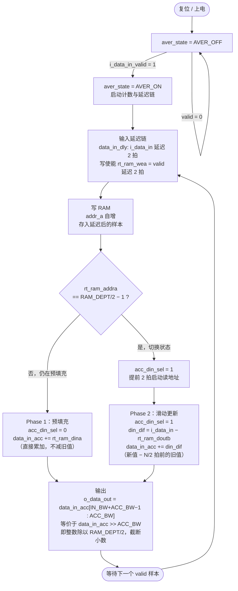
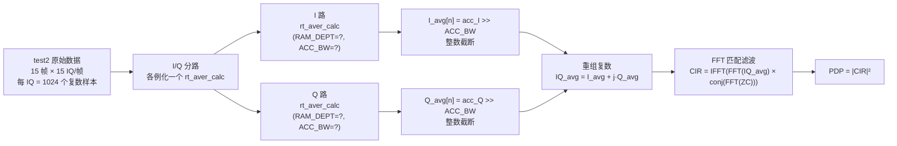

# FPGA 平均逻辑分析：`rt_aver_calc`

## 模块参数

| 参数         | 默认值         | AGC 例化值     | 含义                             |
| ---------- | ----------- | ----------- | ------------------------------ |
| `IN_BW`    | 16          | 33（=2×16+1） | 输入数据位宽                         |
| `RAM_DEPT` | 2048        | 8           | 循环缓冲区深度                        |
| `ACC_BW`   | 10          | 2           | 累加器附加位宽，= clogb2(RAM_DEPT/2−1) |
| 窗口大小       | 1024        | 4           | = RAM_DEPT/2                   |
| 输出右移       | >>10（÷1024） | >>2（÷4）     | = ACC_BW                       |

> **当前工程（channel_ground_v4）唯一例化位置**：`adi_agc_ctrl.v:137`，用于 AGC 功率估计。
> 工程师所述"除 16"（对应 RAM_DEPT=32）在当前源码中未找到，待确认所属版本/模块。

---

## 状态机与主流程



---

## 两阶段详细说明

### Phase 1：预填充（前 N/2 个样本）

```
输入第 0 个样本 → acc += x[0]
输入第 1 个样本 → acc += x[1]
...
输入第 N/2−1 个样本 → acc += x[N/2−1]
    → acc = Σ x[0..N/2−1]
    → 切换至 Phase 2
```

**特征**：窗口未满时，输出 = 累积和 / (RAM_DEPT/2)，是"欠满"均值。

### Phase 2：滑动更新（N/2 个样本之后）

```
输入第 n 个样本（n ≥ N/2）：
    old = RAM[n mod RAM_DEPT]      ← N/2 拍前写入的旧值
    din_dif = x[n] − old
    acc += din_dif
    → acc = Σ x[n−N/2+1 .. n]     ← 始终保持窗口内 N/2 个样本之和
    → output = acc >> ACC_BW       ← 整数右移截断
```

**增量更新公式**：

$$\text{acc}[n] = \text{acc}[n-1] + x[n] - x[n - N/2]$$

$$\text{output}[n] = \text{acc}[n] \gg \text{ACC\_BW} = \left\lfloor \frac{\text{acc}[n]}{N/2} \right\rfloor$$

---

## 关键时序

```
时钟拍数:       0    1    2    3    4    5    ...
i_data_in:    x[0] x[1] x[2] x[3] x[4] x[5]
               │
               └─延迟2拍─→ rt_ram_dina（写入RAM）
                            │
                            └─触发 rt_ram_wea（写使能）

rt_ram_doutb（读出旧值）: 延迟 1 拍（RAM_DLY=1）
din_dif 计算:  i_data_in - rt_ram_doutb → 再延迟1拍后更新 acc
```

> 读地址在 `rt_ram_addra == RAM_DEPT/2 − 3` 时提前启动，补偿 RAM 读延迟（1拍）和 din_dif 计算延迟（1拍），使新旧值对齐。

---

## test2 场景下的处理推断



**待确认（需工程师提供）**：
- [ ] IQ 平均的实际模块名和文件位置
- [ ] RAM_DEPT 参数值（工程师口述"除 16" → 推测 RAM_DEPT=32）
- [ ] 是否跳过第 0 个 ZC 序列

---

## Python 模拟（test3）与 FPGA 的对应关系

| 步骤 | FPGA | test3 Python 模拟 |
|------|------|-------------------|
| 输入量化 | int16 ADC 输出 | `× 32768 → int32` |
| I/Q 分路 | 两个独立 `rt_aver_calc` | `np.real` / `np.imag` 分别处理 |
| 累加 | 整数 acc（Phase 1 预填充） | `I_int.sum(axis=0)` |
| 输出截断 | `acc >> ACC_BW` | `I_acc >> ACC_BITS`（算术右移） |
| CIR 计算 | FFT + IFFT | `correlate_single`（FFT 实现）|
| **主要差异** | ÷ (RAM_DEPT/2)，截断 | ÷ 16，截断（基于口述假设）|

---

## 理论误差分析

整数平均相对于浮点精确均值，存在三类误差，重要性依次递减。

### 误差一：系数误差（最主要）

**成因**：实际累加 $N_\text{real}$ 个样本，但右移 $\text{ACC\_BW}$ 位等价于除以 $M = 2^{\text{ACC\_BW}}$，当 $N_\text{real} \neq M$ 时产生系统性幅度偏差。

$$\hat{\mu}_\text{FPGA} = \frac{\text{acc}}{M} = \frac{N_\text{real}}{M} \cdot \mu_\text{true}$$

**前提条件**：$N_\text{real} < M$（预填充阶段，窗口未满）。

| 场景 | $N_\text{real}$ | $M = 2^4$ | 系数 $\alpha$ | 幅度误差 | PDP 误差 |
|------|----------------|-----------|--------------|---------|---------|
| 跳过 IQ#0，累加14个 | 14 | 16 | 14/16 = 0.875 | −1.16 dB | −2.31 dB |
| 不跳过，累加15个 | 15 | 16 | 15/16 = 0.9375 | −0.56 dB | −1.12 dB |
| 窗口恰好填满 | 16 | 16 | 16/16 = 1.000 | 0 dB | 0 dB |

$$\text{幅度误差} = 20\log_{10}\alpha \quad \text{PDP 误差} = 20\log_{10}\alpha^2 = 40\log_{10}\alpha$$

**关键结论**：该误差是全频带一致的常数乘子，在 PDP **归一化**（`pdp_db -= pdp_db.max()`）后完全抵消，不影响归一化 PDP 的形状和 peak delay。

---

### 误差二：量化误差

**成因**：浮点 IQ 映射为 int16 时，每个样本引入均匀分布的量化噪声。

$$e_q \sim \mathcal{U}\!\left[-\frac{\Delta}{2},\, \frac{\Delta}{2}\right], \quad \Delta = \frac{1}{2^{B-1}} = \frac{1}{32768}$$

对 $N_\text{real}$ 个独立量化样本累加后右移 $k$ 位，输出的量化噪声方差为：

$$\sigma_q^2 = \frac{N_\text{real} \cdot \Delta^2 / 12}{(2^k)^2} = \frac{N_\text{real}}{12 \cdot 2^{2k} \cdot 32768^2}$$

代入 $N_\text{real}=14,\; k=4$：

$$\sigma_q^2 = \frac{14}{12 \times 256 \times 32768^2} \approx 1.7 \times 10^{-12}$$

$$\sigma_q \approx 1.3 \times 10^{-6} \quad \text{（单位：归一化幅度）}$$

相比信号幅度（量级 $10^{-2} \sim 10^{-1}$），信噪比约为：

$$\text{SNR}_q \approx 20\log_{10}\frac{0.01}{1.3\times10^{-6}} \approx 78 \text{ dB}$$

**结论**：int16 量化噪声远低于热噪声（测量 SNR ~50 dB），**可以忽略**。

---

### 误差三：截断误差（floor vs round）

**成因**：`acc >> k` 等价于向下取整（floor），而非四舍五入（round），引入 $[0, 1)$ 个 LSB 的单侧偏差。

$$\varepsilon_\text{trunc} = \left\lfloor \frac{\text{acc}}{2^k} \right\rfloor - \frac{\text{acc}}{2^k} \in (-1,\; 0]$$

均值 $= -0.5$ LSB（系统性负偏），方差 $= 1/12$ LSB²。

换算为信号幅度单位（1 LSB = $1/32768$）：

$$|\varepsilon_\text{trunc}| < \frac{1}{32768} \approx 3 \times 10^{-5}$$

**结论**：量级极小，**可以忽略**。

---

### 误差汇总

| 误差类型 | 量级 | 对归一化 PDP 的影响 | 处置 |
|---------|------|-------------------|------|
| **系数误差**（$N/M \neq 1$） | −1.16 ~ −2.31 dB | **归一化后完全消除** | 无需处理 |
| 量化误差（int16） | SNR > 78 dB | 远低于热噪声，不可见 | 可忽略 |
| 截断误差（floor） | < 3×10⁻⁵ | 不可见 | 可忽略 |

**总结**：在归一化 PDP 对比中，整数平均引入的理论误差接近 **0**。若 test2 与 test3 的 PDP 存在明显差异，来源必然是 FPGA 的**定点 FFT 量化**或**其他未建模的处理步骤**，而非平均运算本身。
